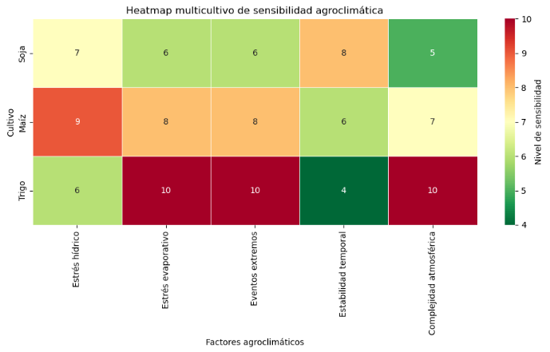
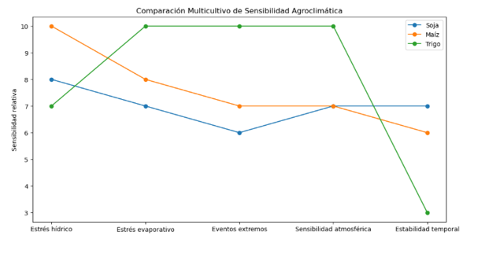
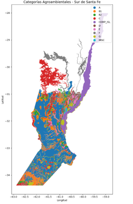
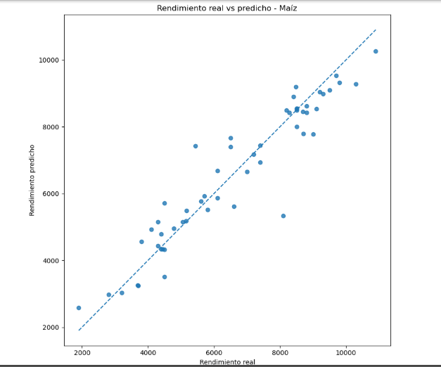
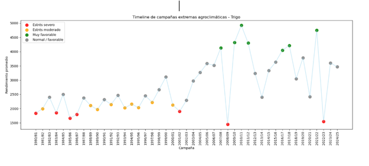

# 🌾 Análisis Agroclimático Multicultivo y Modelado Predictivo en Santa Fe (1980–2024)

Proyecto de análisis agroclimático regional enfocado en soja, maíz y trigo mediante integración de datos meteorológicos NOAA GSOD, machine learning, análisis de eventos extremos y herramientas geoespaciales (GIS).

---

## 📌 Objetivo del proyecto

Desarrollar modelos agroclimáticos capaces de analizar y representar la relación entre variables atmosféricas, eventos extremos y rendimiento agrícola en la provincia de Santa Fe durante el período 1980–2024.

El proyecto integra:

* análisis climático regional,
* modelado predictivo,
* machine learning,
* análisis multicultivo,
* eventos extremos,
* sensibilidad agroambiental,
* herramientas GIS.

---

## 🌎 Cultivos analizados

* 🌱 Soja
* 🌽 Maíz
* 🌾 Trigo

---

## 📊 Tecnologías y herramientas utilizadas

* Python
* Pandas
* NumPy
* Matplotlib
* Scikit-learn
* GeoPandas
* Machine Learning (Random Forest)
* NOAA GSOD
* GIS / análisis geoespacial

---

## 📊 Dashboard interactivo Power BI

Dashboard multicultivo desarrollado en Power BI para visualizar los resultados del análisis agroclimático de soja, maíz y trigo en el sur de Santa Fe.

Incluye:

- Indicadores KPI de rendimiento por cultivo.
- Evolución histórica del rendimiento (1980–2024).
- Importancia de variables agroclimáticas mediante modelos de Machine Learning.
- Navegación interactiva entre cultivos.
- Dashboard ejecutivo comparativo multicultivo.

### Visualizaciones

#### Dashboard Ejecutivo


#### Soja


#### Maíz


#### Trigo


## 🛰️ Variables agroclimáticas analizadas

* precipitación,
* humedad relativa,
* VPD,
* ENSO,
* amplitud térmica,
* estrés hídrico,
* eventos extremos,
* estabilidad temporal,
* variables atmosféricas regionales.

---

## 🔥 Principales resultados

* Desarrollo de modelos predictivos multicultivo con alto desempeño estadístico.
* Identificación de sensibilidad diferencial entre soja, maíz y trigo.
* Integración de análisis espacial mediante herramientas GIS.
* Detección de campañas agrícolas afectadas por eventos extremos.
* Construcción de dashboards ejecutivos e indicadores agroclimáticos regionales.

---

## 📁 Estructura del repositorio

```bash
data/              → datasets climáticos y agrícolas
notebooks/         → notebooks de análisis y modelado
models/            → modelos predictivos
dashboard/         → visualizaciones y dashboards
images/            → mapas y gráficos
informe_final/     → informe técnico final en PDF
```

---

## 📄 Informe técnico completo

El informe técnico final puede encontrarse dentro de:

```bash
informe_final/
```

---

## 📷 Visualizaciones del proyecto

### Heatmap multicultivo


### Comparación multicultivo


### Categorías agroambientales GIS


### Rendimiento real vs predicho — Maíz


### Timeline de campañas extremas — Trigo


## 🌾 Autor
**Aylen Sabrina Ciarrocchi**
Argentina 🇦🇷

Proyecto desarrollado como iniciativa de análisis agroclimático aplicado, integrando ciencia de datos, agricultura y climatología regional.
